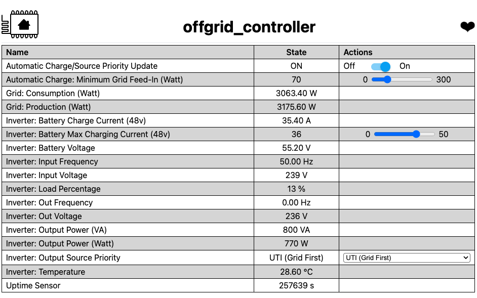
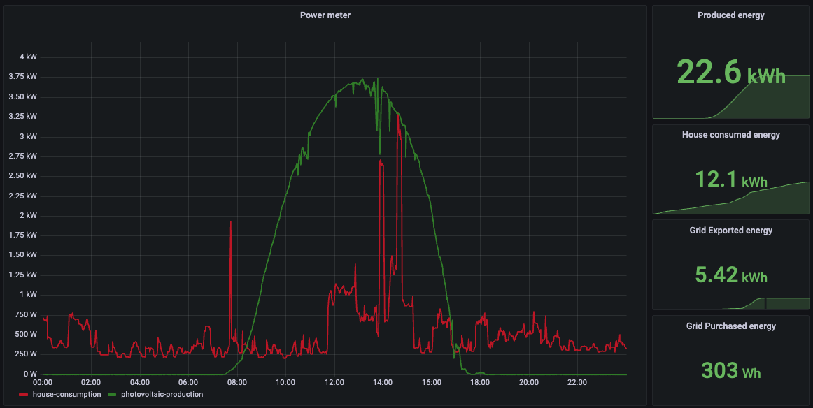

# My Offgrid Controller

 This system is designed to optimize the use of renewable energy in my home by managing the charging of a LiFePo4 battery from excess power generated by a hybrid inverter. When the grid is inactive or the solar input is insufficient, the house switches to off-grid, ensuring energy autonomy and efficiency.

## How It Works

The core of this project lies in the smart utilization of surplus energy. The ESP32 monitors the house consumption and the hybrid inverter production. When the hybrid inverter produces more power than the house demands, the ESP32 starts charing the batteries.

## Disclaimer

This repository serves as a digital archive for my project, primarily for backup and documentation purposes. While I'm sharing it publicly in the hope it might offer insights or inspiration to others, it's tailored to my specific setup and needs.

- **Educational Scope**: This project is experimental and educational. It's not designed for commercial or production environments and lacks official certifications.
- **High Voltage Warning**: Handling high-voltage systems can be hazardous. If you're not experienced or confident in dealing with such setups, please consult with a professional electrician.
- **No Responsibility**: I assume no liability for any damage or injuries resulting from the use of this project. Your engagement with this system is at your sole risk.

## Hardware Components

- **Energy Storage**: LiFePo4 battery (48V, 15KWh)
- **Controller**: [Olimex ESP32-POE](https://www.olimex.com/Products/IoT/ESP32/ESP32-POE/open-source-hardware)
- **Communication**: 2x RS485 to TTL converters
- **Current sensing**: 2x pzem-016 current sensors
- **Monitoring**: Grafana + Graphite deployment

## Screenshots

Below are some screenshots from the project, showcasing the system's interface and the hardware setup.

